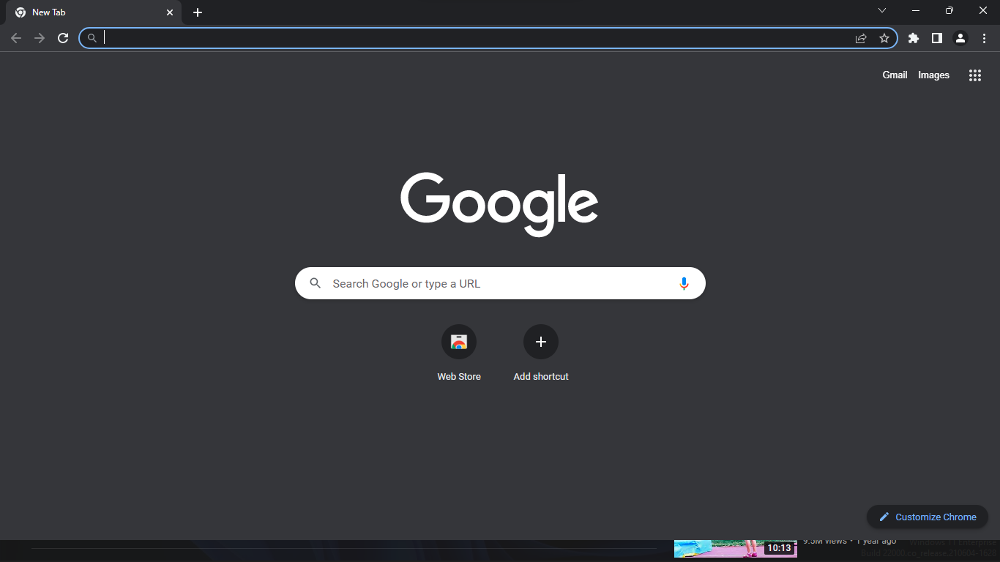

***To extract passwords from the browser***
## Installation
Run, if the program cannot run correctly, it will install its necessary libraries when connected to the Internet
## Run
python main.py
## LICENSE
This project is using the GNU GENERAL PUBLIC LICENSE Version 3, 29 June 2007. It is included in the project source code.